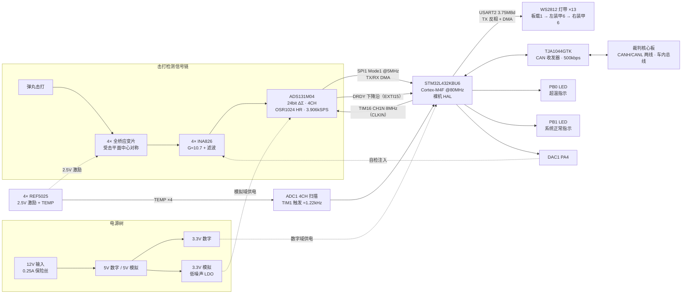
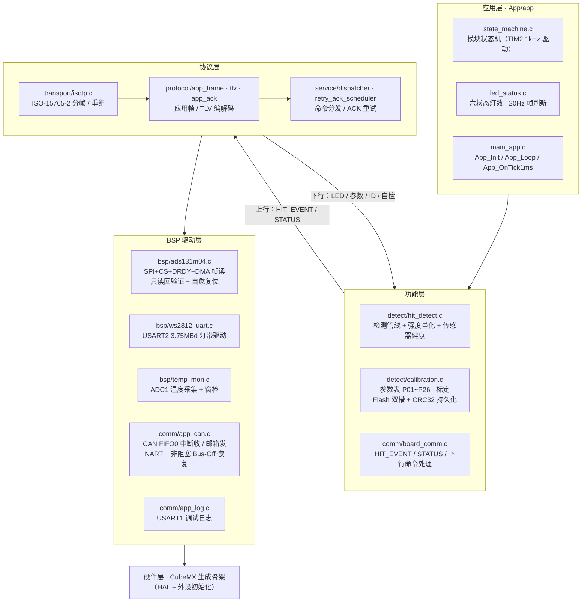

# 装甲模块介绍（Armor_Cmzy26_081）

> 本文档面向模块功能与能力介绍；完整设计（14 章：需求、寄存器级驱动、算法推导、协议、风险清单）见《装甲模块固件设计方案》。引脚/寄存器的权威定义以 CubeMX `.ioc` 为准。

## 1. 模块定位

对标 RoboMaster 2025 裁判系统**装甲板模块**的自研实现（硬件 rev 080/081）：检测弹丸击打、按官方语义驱动装甲灯带、经车内 CAN 总线与裁判核心板通信。作为车队自研"车内总线"节点，模块不直连官方裁判系统，仅与车队核心板通过 CAN 500kbps + ISO-15765-2（ISO-TP）协议交互。

模块 = 1 块主控板（STM32L432KBU6 @80MHz，裸机 HAL，无 RTOS）+ 4 个应变传感区 + 灯带（板载 1 颗 + 左右装甲板各 6 颗，共 13 颗 WS2812），经裁判系统 6 脚连接器接入（信号线仅 CANH/CANL 两线）。

## 2. 硬件组成

硬件框图：

| 部分 | 方案 | 说明 |
|---|---|---|
| 传感 | 4× 全桥应变片 | 中心对称分布，四通道融合检测 |
| 模拟前端 | 4× INA826（G≈10.7）+ RC 滤波 | 放大器输出接 ADC 正端，直流偏置共用接负端 |
| 量化 | ADS131M04 | 24bit ΔΣ、4 通道、3.906kSPS（OSR=1024/HR），内部 VREF=1.2V |
| 主控 | STM32L432KBU6 @80MHz | Cortex-M4F，裸机 HAL |
| 灯 | WS2812 灯带 ≤13 颗（GL5050） | USART2 3.75MBd + TX 反相 + DMA，GRB 序 |
| 通信 | CAN1 + TJA1044GTK | 500kbps 车内总线 |
| 指示 | PB0 / PB1 板载 LED | PB0=超温指示、PB1=系统正常指示 |
| 电源 | 12V → 5V → 3.3V 数字/模拟双链 | 模拟域低噪声 LDO；4× REF5025 提供 2.5V 电桥激励与温度监测 |

## 3. 核心功能

### 3.1 击打检测

- **四通道融合模型**：一次击打在四通道同时产生响应，检测以四通道分力之和（合力）为判定信号——合力与击打位置无关，单次击打天然只产生一个事件。
- **处理管线**：逐通道 EMA 基线跟踪（τ≈2.1s，抑制安装形变/温漂/姿态变化）→ 高通去直流 → 差分高通（抑制 0.1~10Hz 低速摆动误报，冲击边沿无损）→ 合力合成 → 32 样本窗口峰值 → 阈值 + 持续判定（≥1.02ms）→ 50ms 不应期 → 沉降门控（机械余振衰减前不重新武装，杜绝一次击打计两次）。
- **检测能力**：最高 20Hz 连发、最小检测力 19N、最大承受 490N（阈值与力度经砝码两点标定）。
- **事件内容**：合力峰值、强度（0–100%）、力度（0.01N）、四通道峰值分布（反映击打位置）、时间戳。
- **端到端时延** <3ms。

### 3.2 灯光指示

与官方语义对齐的六状态灯效（帧刷新 20Hz）：

| 状态 | 灯效 | 板载 LED |
|---|---|---|
| NORMAL（正常） | 队色常亮 | PB1 亮 |
| HIT（击打） | 队色 5Hz 快闪 | PB1 亮 |
| ID_SETUP（ID 设置） | 队色 1Hz 慢闪 | PB1 亮 |
| FAULT（故障） | 红蓝交替 | PB1 灭；PB0 超温时亮 |
| COMM_LOST（通信失败） | 紫色常亮 | 灭 |
| ID_CONFLICT（ID 冲突） | 红蓝紫循环 | 灭 |
| BOOT（自检） | 白色 300ms | 灭 |

队色与发射机构统一（红队粉、蓝队湖蓝），全局亮度可调（0–100%）。

### 3.3 CAN 通信

- **物理层**：CAN 500kbps（采样点 87.5%），收发 ID 默认 0x1A0/0x2A0（以《通信协议 v2》为准）。
- **协议栈**：ISO-15765-2（ISO-TP）分帧重组 + 应用帧/TLV 编解码 + ACK 重试（3 次 × 200ms）。
- **上行**：心跳 20Hz、状态上报（默认 1Hz 可调）、击打事件（不重试）；**下行**：LED 控制、参数读写、ID 设置（写入 Flash）、自检触发、零偏标定。
- **掉线管理**：200ms（4× 心跳）无核心板心跳 → COMM_LOST 紫灯，恢复自动回 NORMAL。
- **死总线鲁棒**：禁用 CAN 自动重传（NART=1），单帧失败 ~250µs 即完成；Bus-Off 寄存器级非阻塞恢复；发送以 TXOK 判真实成败。
- **中断隔离**：DRDY EXTI（优先级最高）> CAN 错误中断——无总线时的 CAN 错误中断风暴不影响采集链路。

### 3.4 健康监测与自检

- **故障诊断**（位图闩存 + 每 5s 自动重试）：传感器饱和、偏置异常、通道无响应、SPI/时钟异常、基准温度出窗、超温、电源跌落（PVD）。
- **温度监测**：4 路 2.5V 基准芯片 TEMP 引脚经 ADC 扫描（≈1.22kHz 硬件触发），兼作板温代理，超温告警联动板载 LED。
- **自检**（上电 + CAN 命令触发）：寄存器回读、DRDY 翻转、噪声/基线统计、温度窗检、DAC 注入激励（可选）。
- **采集链路自愈**：ADC 初始化采用只读回读验证 + 自愈复位序列，跨 MCU 复位可自动恢复异常状态，不依赖外部同步引脚与断电。

### 3.5 参数管理与标定

- **参数表** P01~P26：检测阈值/时间常数、灯效、通信周期、保护阈值等，经 CAN 在线读写并即时生效。
- **标定**：19N/100N 两点力度标定（合力模型，加载位置无关）、通道一致性归一化、通道极性校对（实测固化，可经参数通道覆盖）。
- **持久化**：参数 + armor_id + 极性掩码 + 零偏基线写入 Flash 双槽 + CRC32；上电预擦非活动槽，保存过程零跳帧。

## 4. 固件架构

固件框图：

| 上下文 | 工作 |
|---|---|
| DRDY EXTI（优先级最高 0） | 每 256µs 启动一次 SPI+DMA 帧读取 |
| DMA 完成中断 | 帧入 K=32 环形缓冲（8.2ms 预触发历史） |
| TIM2 1kHz 中断 | 状态机步进、灯效相位、健康评估（只计算+置标志） |
| 主循环 | 帧消费 → 检测管线 → 事件输出 → 协议入队/日志（非阻塞环形） |

## 5. 关键指标

| 指标 | 值 |
|---|---|
| 采集 | 4 通道 24bit @3.906kSPS（帧周期 256µs），单帧 SPI 传输 28.8µs 占采样周期 11%，CPU 开销 ≈0.8% |
| 击打事件端到端时延 | <3ms |
| 检测范围 | 19N~490N，最高 20Hz 连发 |
| 灯效 | 13 颗 WS2812，20Hz 帧刷新，六状态语义 |
| 通信 | CAN 500kbps + ISO-TP，心跳 20Hz，掉线判定 200ms |
| CPU 负载 | ≈5~6%（80MHz） |
| RAM 占用 | ≈14KB / 64KB |
| 供电 | 12V 输入（0.25A 保险丝） |

## 6. 预留扩展能力

- **波形捕获**：击打触发时冻结环形缓冲窗口（预触发 + 触发后各 8.2ms），输出完整冲击波形供核心板二次处理。
- **击打位置估算**：由四通道峰值分布反推击打位置（接口已预留）。
- **弹速/入射角反推**：冲量–撞击时间联合估计（接口已预留，需实弹标定）。
- **采样率可调**：OSR 降档可提升至 7.8k/15.6kSPS（参数在线切换）。
